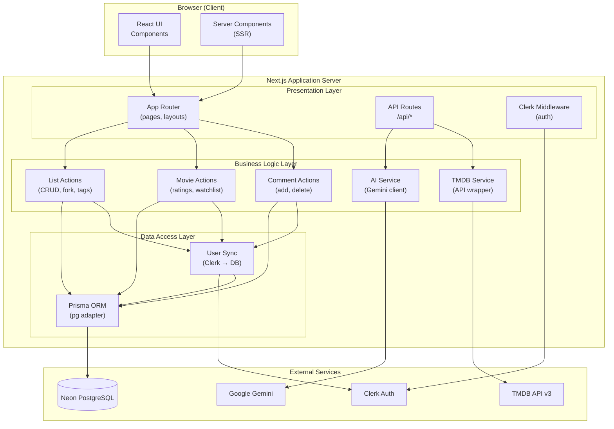
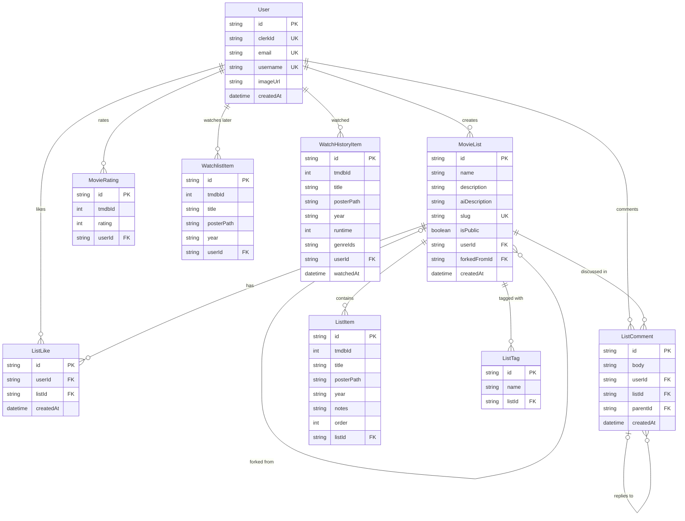
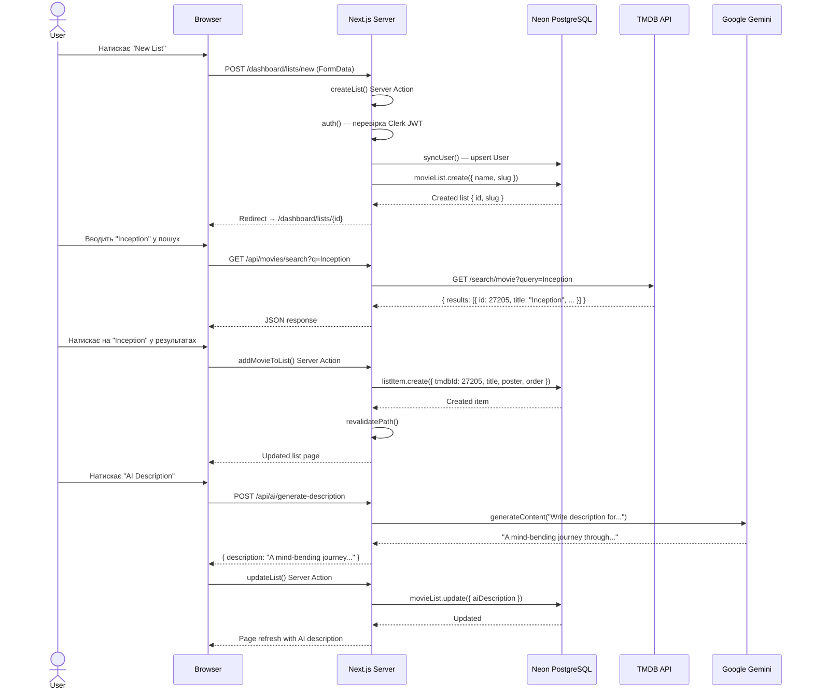

# Діаграми архітектури та бізнес-процесів

## 1. Тема та deliverables бакалаврської роботи

**Тема:** Веб-застосунок для створення та обміну списками фільмів з використанням TMDB API та AI-генерації персоналізованого контенту.

**Deliverables:**

1. **Веб-застосунок CineList** — повнофункціональний веб-додаток з можливістю створення, редагування, обміну та форкінгу списків фільмів
2. **Інтеграція з TMDB API** — доступ до бази даних 900 000+ фільмів з детальною інформацією (каст, трейлери, рейтинги)
3. **AI-модуль** — генерація описів списків, рекомендації фільмів та аналіз трендів на основі Google Gemini
4. **Соціальні функції** — публічні списки, коментарі, лайки, форкінг, персональні рейтинги
5. **Пояснювальна записка** — документація з описом архітектури, технологій та результатів дослідження

---

## 2. Аналіз типів діаграм (3 категорії × 3 варіанти)

### 2.1. Структурні діаграми

#### 2.1.1. Component Diagram (UML)

Діаграма компонентів UML показує організацію та залежності між програмними компонентами системи. Компоненти зображуються як прямокутники зі стереотипом `<<component>>`, а залежності — стрілками.

**Переваги:**
- Стандартизована нотація UML 2.x, зрозуміла широкій аудиторії
- Чітко показує інтерфейси та залежності між модулями
- Підтримується більшістю CASE-інструментів

**Недоліки:**
- Може бути надмірно деталізованою для простих систем
- Не відображає runtime-поведінку або потоки даних

#### 2.1.2. Deployment Diagram (UML)

Діаграма розгортання UML моделює фізичну топологію системи — вузли (сервери, пристрої), артефакти та з'єднання між ними. Вузли зображуються як тривимірні прямокутники.

**Переваги:**
- Єдина UML-діаграма, що показує фізичну інфраструктуру
- Корисна для DevOps та планування розгортання
- Показує зв'язок між програмними артефактами та апаратним забезпеченням

**Недоліки:**
- Для хмарних/serverless архітектур може бути неінтуїтивною
- Швидко застаріває при зміні інфраструктури

#### 2.1.3. Package Diagram (UML)

Діаграма пакетів UML показує логічне групування елементів системи та залежності між групами. Пакети зображуються як «папки» з вкладеними елементами.

**Переваги:**
- Ефективна для показу модульної структури великих проєктів
- Простий синтаксис, легко читається
- Добре підходить для документування залежностей між шарами архітектури

**Недоліки:**
- Не показує внутрішню структуру компонентів
- Занадто абстрактна для детального проєктування

---

### 2.2. Діаграми даних

#### 2.2.1. ER-діаграма (нотація Чена)

Entity-Relationship діаграма в нотації Пітера Чена використовує прямокутники для сутностей, ромби для зв'язків та овали для атрибутів. Оригінальна нотація, запропонована у 1976 році.

**Переваги:**
- Класична нотація, добре відома в академічному середовищі
- Чітко розділяє сутності, зв'язки та атрибути візуально
- Підходить для концептуального моделювання на ранніх етапах

**Недоліки:**
- Займає багато місця на діаграмі через окремі овали для атрибутів
- Менш практична для великих схем з десятками таблиць
- Не відображає типи даних напряму

#### 2.2.2. ER-діаграма (нотація Crow's Foot / Martin)

ER-діаграма в нотації «пташина лапка» (Crow's Foot), запропонованій Джеймсом Мартіном. Сутності — прямокутники з атрибутами всередині, зв'язки позначаються лініями з символами кардинальності (|, O, <) на кінцях.

**Переваги:**
- Компактна — атрибути всередині сутності
- Інтуїтивні символи кардинальності (1, N, 0..1)
- Найпоширеніша нотація у промисловій розробці та CASE-інструментах

**Недоліки:**
- Менш формальна ніж нотація Чена для академічних робіт
- Символи кардинальності можуть бути незрозумілими без пояснення

#### 2.2.3. Schema Diagram (Database Schema / Physical Data Model)

Фізична діаграма схеми бази даних показує таблиці, колонки з типами даних, первинні та зовнішні ключі, індекси. Відображає реальну структуру БД як вона реалізована в СУБД.

**Переваги:**
- Найточніше відображення реальної структури бази даних
- Показує типи даних, обмеження (NOT NULL, UNIQUE), індекси
- Може бути згенерована автоматично з існуючої БД (reverse engineering)

**Недоліки:**
- Прив'язана до конкретної СУБД
- Надмірна деталізація для концептуального рівня
- Важко читати для нетехнічної аудиторії

---

### 2.3. Діаграми поведінки та взаємодії

#### 2.3.1. Sequence Diagram (UML)

Діаграма послідовності UML показує взаємодію між об'єктами у часі. Об'єкти розташовані горизонтально, а повідомлення (виклики) — вертикальні стрілки зверху вниз у хронологічному порядку.

**Переваги:**
- Чітко візуалізує часову послідовність викликів
- Показує як синхронні, так і асинхронні повідомлення
- Ефективна для документування API-взаємодій та протоколів

**Недоліки:**
- Стає нечитабельною при великій кількості учасників (>7)
- Не показує умови розгалуження добре (alt/opt фрагменти громіздкі)

#### 2.3.2. Activity Diagram (UML)

Діаграма діяльності UML моделює потік управління або дані між діями. Використовує елементи: дія (округлений прямокутник), рішення (ромб), початковий/кінцевий вузли, fork/join для паралелізму.

**Переваги:**
- Інтуїтивна нотація, схожа на блок-схеми
- Підтримує паралельні потоки (fork/join)
- Добре підходить для моделювання бізнес-процесів та алгоритмів

**Недоліки:**
- Може бути надмірно деталізованою для простих процесів
- Не показує хто виконує дії (без swimlanes)

#### 2.3.3. Use Case Diagram (UML)

Діаграма варіантів використання UML показує функціональні вимоги системи з точки зору зовнішніх акторів. Актори — stick figures, варіанти використання — овали, зв'язки — лінії `<<include>>`, `<<extend>>`.

**Переваги:**
- Найкращий спосіб показати функціональний обсяг системи
- Зрозуміла нетехнічній аудиторії (замовники, менеджери)
- Визначає межі системи та ролі користувачів

**Недоліки:**
- Не показує порядок виконання дій
- Занадто абстрактна для технічної реалізації
- Зв'язки `<<include>>`/`<<extend>>` часто використовуються некоректно

---

## 3. Реалізовані діаграми

### 3.1. Діаграма компонентів (Структурна категорія)

**Обрано: Component Diagram (UML)**

**Чому:** CineList має чітку модульну архітектуру з 6 зовнішніми залежностями та 4 внутрішніми шарами. Component Diagram найкраще показує залежності між модулями та зовнішніми сервісами — це критично для розуміння системи новим розробником.



**Опис:** Діаграма показує тришарову архітектуру CineList: Presentation Layer (App Router, API Routes, Middleware), Business Logic Layer (Server Actions для списків/фільмів/коментарів, AI та TMDB сервіси), Data Access Layer (Prisma ORM, User Sync). Зовнішні залежності: Neon PostgreSQL (дані), TMDB API (метадані фільмів), Google Gemini (AI контент), Clerk (аутентифікація).

---

### 3.2. ER-діаграма (Категорія даних)

**Обрано: ER-діаграма у нотації Crow's Foot**

**Чому:** Нотація Crow's Foot найкраще підходить для візуалізації Prisma-схеми CineList, яка має 8 моделей з численними зв'язками. Компактний формат (атрибути всередині сутностей) дозволяє показати всю схему на одній діаграмі. Mermaid нативно підтримує цю нотацію.



**Опис:** Діаграма показує 9 сутностей бази даних CineList та зв'язки між ними. Центральна сутність — User, від якої залежать усі інші (cascade delete). MovieList має зв'язок "forked from" сама на себе (self-referencing). ListComment підтримує вкладені відповіді через self-referencing parentId. Фільми не зберігаються як окрема сутність — тільки tmdbId (integer) для зв'язку з TMDB API.

---

### 3.3. Діаграма послідовності (Категорія поведінки)

**Обрано: Sequence Diagram (UML)**

**Чому:** CineList має складну взаємодію між 5 учасниками при ключовому use case — створенні списку з AI-описом. Sequence Diagram найкраще показує часову послідовність HTTP-запитів, Server Actions та зовнішніх API-викликів у цьому процесі.



**Опис:** Діаграма показує повний цикл створення списку фільмів з AI-описом. 4 етапи: (1) створення списку через Server Action з генерацією slug, (2) пошук фільму через API route → TMDB API, (3) додавання фільму до списку через Server Action, (4) генерація AI-опису через API route → Google Gemini → збереження через Server Action. Кожен крок показує конкретні HTTP-методи, функції та дані.

---

## 4. Вихідний код діаграм

Всі три діаграми реалізовані у форматі **Mermaid** — це текстовий DSL для діаграм, що рендериться нативно на GitHub, GitLab, та у більшості Markdown-рендерерів.

Вихідний код кожної діаграми наведено безпосередньо у цьому документі всередині блоків ` ```mermaid `. Для локального рендерингу можна використати:

```bash
# Встановити Mermaid CLI
npm install -g @mermaid-js/mermaid-cli

# Рендерити в PNG
mmdc -i docs/diagrams.md -o diagrams-output.png
```

Або використати онлайн-редактор: [mermaid.live](https://mermaid.live)

---

## Список літератури

1. Fowler M. UML Distilled: A Brief Guide to the Standard Object Modeling Language. 3rd ed. Boston : Addison-Wesley, 2004. 175 p.
2. Chen P. The Entity-Relationship Model — Toward a Unified View of Data. *ACM Transactions on Database Systems*. 1976. Vol. 1, No. 1. P. 9–36.
3. Object Management Group. Unified Modeling Language (UML) Version 2.5.1 : OMG Standard. URL: https://www.omg.org/spec/UML/2.5.1 (дата звернення: 24.03.2026).
4. Martin J. Managing the Data-Base Environment. Englewood Cliffs : Prentice Hall, 1983. 381 p.
5. Mermaid.js Documentation. URL: https://mermaid.js.org/intro/ (дата звернення: 24.03.2026).
6. Prisma. Data Modeling Documentation. URL: https://www.prisma.io/docs/orm/prisma-schema/data-model (дата звернення: 24.03.2026).
